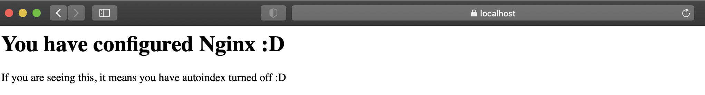
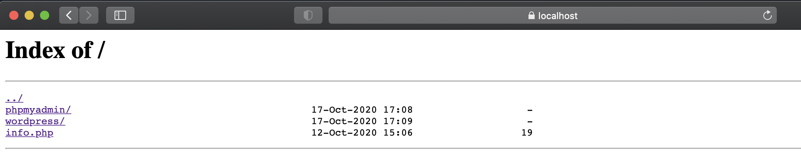
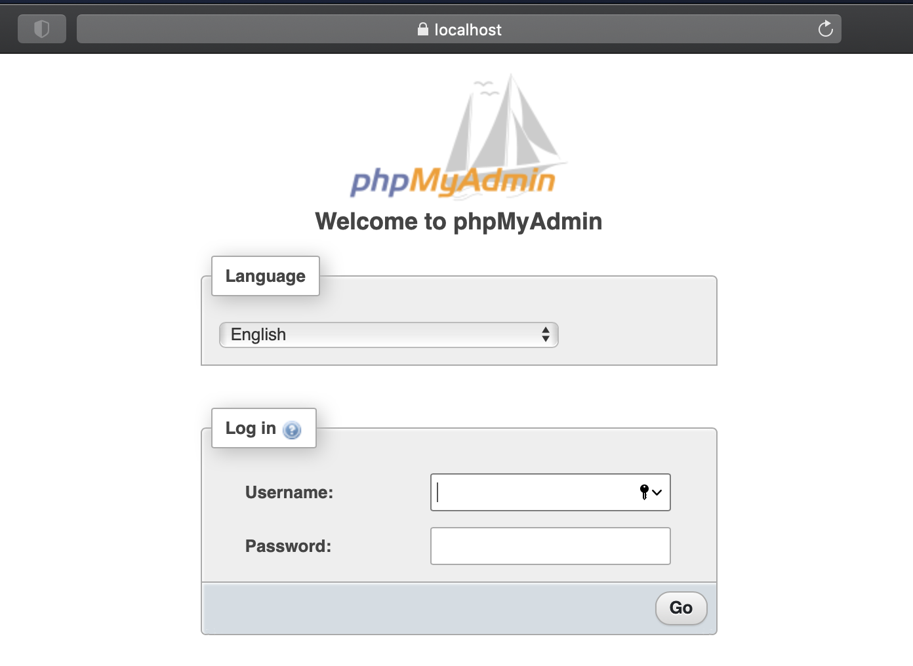
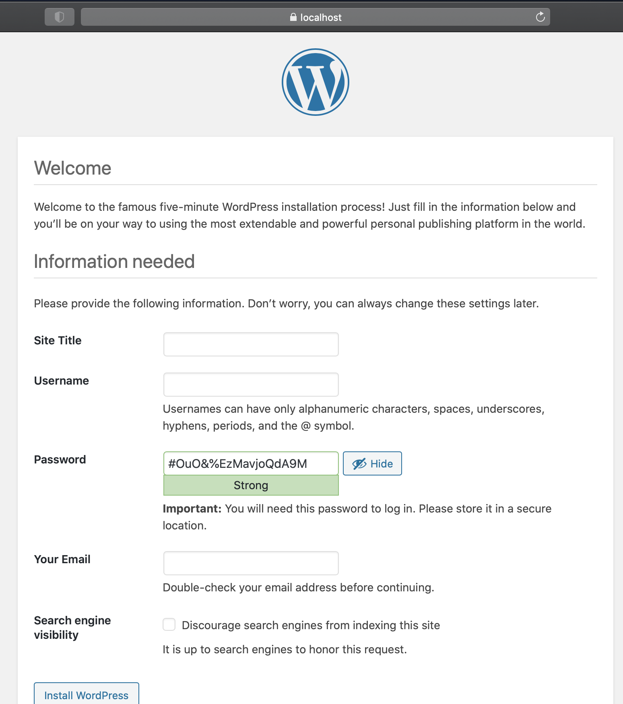
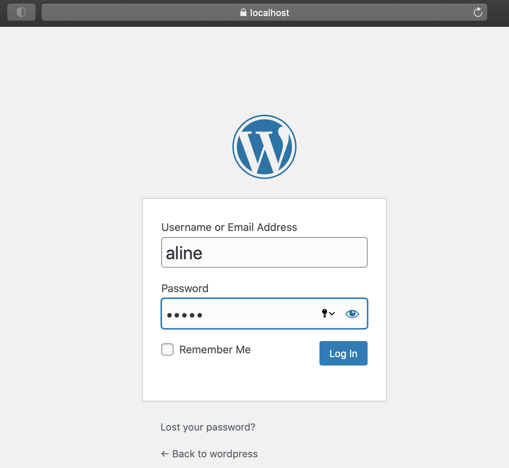
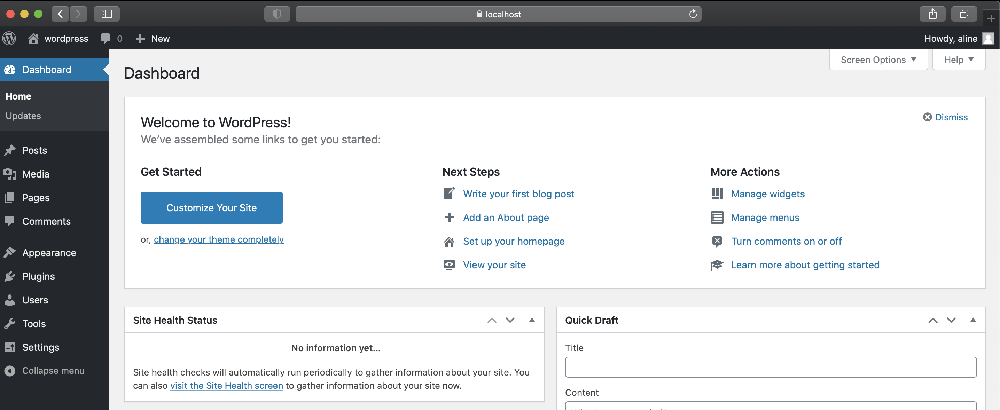
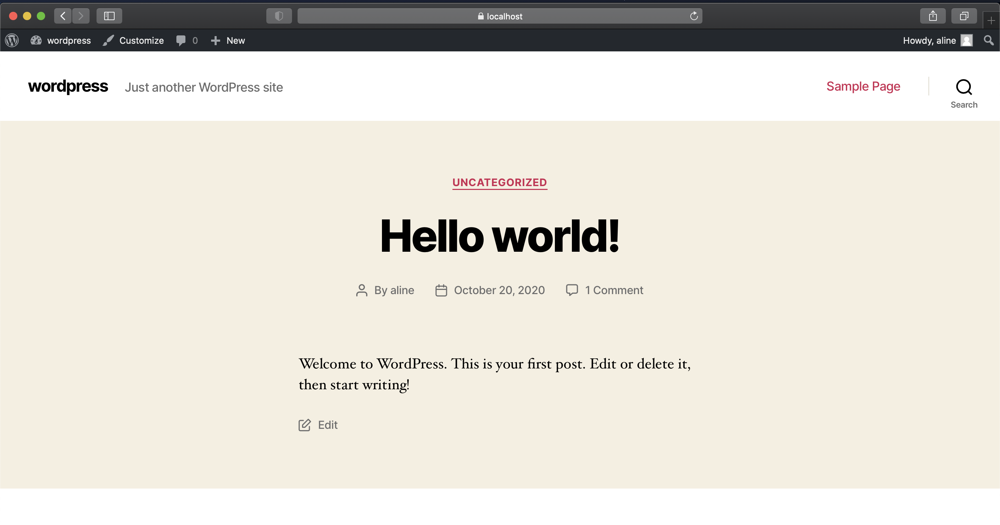

# Ft_server
Setting up my first web server :)

# Introduction
This topic is intended to introduce you to system administration. 
It will make you aware of the importance of using scripts to automate your tasks.
For that, you will discover the "docker" technology and use it to install a complete web server with Nginx. 
This server will run multiples services: 
* Wordpress
* phpMyAdmin
* SQL database

# How to use it?

### Installing
```
git clone https://github.com/alineayumi/ft_server.git
```

### Content
* ```Dockerfile```
Contains the instructions to build the docker image for the server
* ```/srcs```
Contains all scripts and configuration files to support the container
* ```test.sh```
Builds the image and run the container
* ```clean.sh```
Remove and clean all running containers

### Building an image
```docker build -t ft_server .```

### Running a container from the ft_server image (autoindex on by default)
```docker run --name ft_server -it -p80:80 -p443:443 ft_server```

### Running a container with autoindex off
```docker run --env AUTOINDEX=off --name ft_server -it -p80:80 -p443:443 ft_server```

### Access to the container
```docker exec -it ft_server /bin/bash```

### Exploring it
Once your container is running, access it on your browser at ```https://localhost/```

#### Autoindex off 
If the autoindex is turned on, you will see a tree with the directories of your server:


#### Autoindex on
Otherwise, if autoindex is off, will show a page like this:


#### PhpMyAdmin
You can access databases with 2 users in phpMyAdmin:
```
https://localhost/phpmyadmin
```

* admin user (has access to all databases)
* wordpress user (can only access wordpress's tables)

#### Wordpress:
```
https://localhost/wordpress
```
The first time you enter in this url, it will appear a page to create your wordpress page identified by a login and password


So after that you can login with the credentials you just created:


And now start to create/delete posts :D

Using the dashboard:


Or even the site:

You can also manipulate data from phpMyAdmin, accessing the databases from there and editing :D 